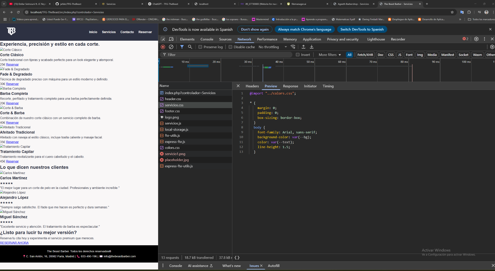

# TFG-TheBeast
## Dificultades

1. Rutas a los diferentes archivos (CSS, imagenes, javascript...) al ser llamados desde index.php la ruta ya no es la misma y he tenido problemas con ello.
2. Problemas al "linkar" servicios.css en la página de "Servicios". 
   
    He tenido que añadir esta linea de código para que me lo cogiese, cuando yo lo quería usar "normal", como el resto de llamadas a archivos css:
    ``` html
    <!--usado este:-->
      <link rel="stylesheet" href="/TFG-TheBeast/src/css/servicios/servicios.css?v=1.1">
    <!--cuando normalmente usaría este:-->
      <link rel="stylesheet" href="css/servicios/servicios.css">

